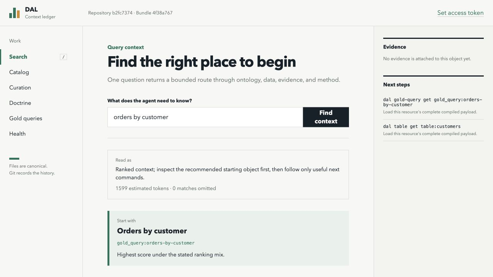
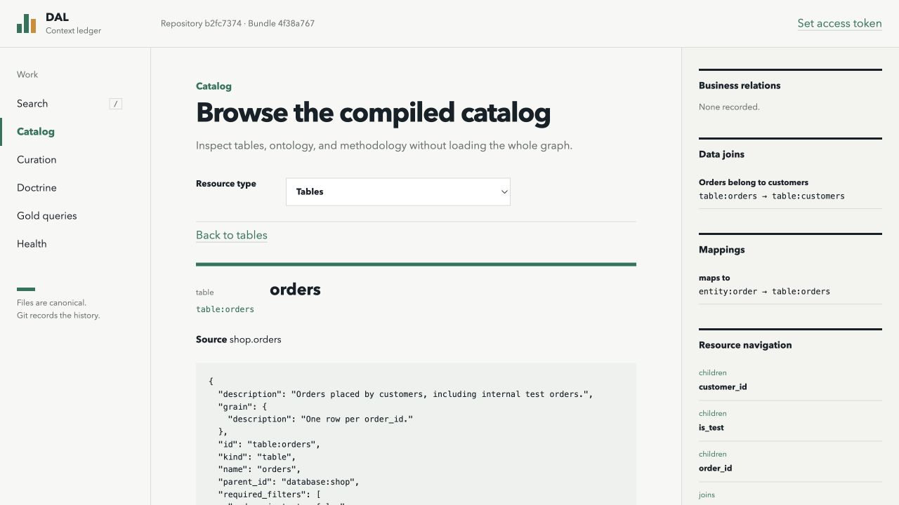
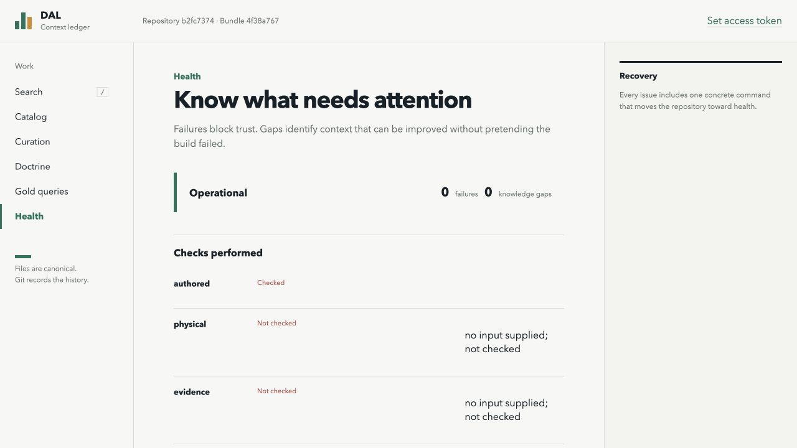

# DAL context graph

Give an AI agent the organizational context it needs to query data correctly, with useful answers in few turns and a bounded response size.

There is one native model, one compiler, and one application service shared by the CLI, REST API, browser UI, and MCP. Import native DAL JSON/YAML documents or migrate former DAL JSON graph exports. The examples and evaluation fixtures are synthetic.

## Install the complete agent skill

With Node.js 20+, npm, and Git installed, run this from your agent project's directory:

```sh
npx github:itamarwe/data-access-layer install --agent claude-code
```

Then use `/dal` in Claude Code and tell it where your context graph lives:

```text
/dal Use the graph at ./context to find the tables and joins for monthly revenue.
```

For Codex, use `--agent codex` and invoke `$dal`. Add `--global` to install for all projects instead of only the current project.

The installer downloads a checksum-verified uv release, installs private Python 3.12 and the DAL runtime, verifies the CLI, and installs the skill with an explicit launcher path. **No separate Python installation, shell activation, or PATH change is needed.** BM25 retrieval, compilation, curation, REST, UI, and MCP are included. Warehouse credentials, your graph, and optional embedding model weights are not.

Downloads require internet access; archive extraction uses `tar` (included on current macOS, Linux distributions, and Windows). Artifacts are provided for x64 and arm64 on those platforms. Runtime files live in `~/.local/share/dal`, overridable with `DAL_HOME`. Nothing is installed into system Python and no shell profiles are edited.

The complete installation has been tested on macOS arm64. Linux and Windows download mappings are included but have not yet been verified end-to-end.

The generated skill gives an exact launcher command with absolute Node and Python paths, used in place of `dal` in the examples below. This also works in an already-running Claude session without a new PATH. Keep the installed skill's machine-specific `runtime.json` local; rerun the installer on each machine. An existing changed skill is preserved in a backup before replacement. Repeating an unchanged installation reuses its healthy runtime.

For optional embedding libraries, add `--embeddings`; model weights are acquired later when you build with `--embedding-model`. See [setup details](skills/dal/references/setup.md).

This command executes the package directly from GitHub; it does not require an npm registry publication. The older `npx skills add ...` command installs **instructions only** and is not the complete installer.

## Run from source

For contributors or a standalone CLI demonstration, use Python 3.11 or newer. Skill users do not need this separate setup.

```sh
git clone https://github.com/itamarwe/data-access-layer.git
cd data-access-layer
python3 -m venv .venv
. .venv/bin/activate
python -m pip install -e '.[dev]'
dal --repository examples/shop build
dal --repository examples/shop search "orders by customer"
dal --repository examples/shop serve
```

On Windows, activate `.venv\Scripts\Activate.ps1` in PowerShell instead. Open [the local UI](http://127.0.0.1:8765); `/api/docs` contains the REST API reference. The server is local by default. Exposing it on another interface requires explicit remote access and a bearer token; use TLS at your reverse proxy.

For a new graph:

```sh
dal --repository /path/to/context init
dal --repository /path/to/context import /path/to/catalog.yaml
dal --repository /path/to/context validate
dal --repository /path/to/context build
dal --repository /path/to/context search "customer retention" --token-budget 1600
```

The importer never overwrites conflicting authored objects or modifies source files. Migration reports identify unsupported nodes and missing join endpoints in former DAL JSON graph exports. Custom DuckDB catalogs and ZIP archives are not supported.

## UI

Actual screenshots of the bundled UI using the synthetic `examples/shop` graph.

Search returns a recommended starting point and suggested next commands within an estimated context budget.



The catalog separates data joins, business relations, and ontology mappings.



Health distinguishes local checks from source checks that have not run.



To reproduce: build and serve `examples/shop`, search for `orders by customer`, open **Catalog → Tables → orders**, then **Health**.

## Files are the source of truth

```text
semantic/*.yaml       native resources; JSON is also accepted
proposals/*.yaml      open, published, or dismissed proposals
evidence/*.json       immutable, content-addressed source records
.dal/query/           disposable DuckDB query bundles and active pointer
```

Track the first three directories with Git if their contents are appropriate for your repository. Treat organizational SQL, schema names, and source evidence as potentially sensitive. Do not commit credentials or generated bundles.

Edit resource files directly or use a proposal. Both change the same files; there is no second editable database. Run `dal build` to update retrieval after edits. The long-running server picks up a newly activated bundle on its next request.

Resources use `version: 1` and a flat `objects` array. References use stable IDs, so files and arrays can be reorganized without changing identity. See [the example](examples/shop/semantic/catalog.yaml) and [the specification](SPEC.md).

## Commands

- `dal search "question"`: one cross-type search entry point.
- `dal connections OBJECT_ID`: separate groups for business relations, data joins, and ontology-to-data mappings. Membership and knowledge references remain ordinary fields and navigation.
- `dal table|column|join|entity|property|relation|metric|doctrine|gold-query|database list|get|search`: typed access.
- `dal proposal list|create|publish|dismiss|deprecate`: optional curator review.
- `dal validate`, `dal build`, `dal health`: validation, compilation, and explicit health checks.
- `dal serve`: REST and browser UI.
- `dal mcp`: the same retrieval services over MCP stdio.

Global `--repository` and `--bundle` options precede the command. Search returns detailed leading matches, compact alternatives, evidence, related methodology, gaps, omissions, and useful next commands. `--token-budget` is an **estimated** bound based on UTF-8 bytes divided by four, not a model-tokenizer guarantee.

There is one default ranking mix. Override individual weights with `--weight lexical=0.5 --weight embedding=0.5`. BM25 runs without model downloads. For real local embeddings:

```sh
python -m pip install -e '.[embeddings]'
dal --repository examples/shop build --embedding-model BAAI/bge-small-en-v1.5
```

The first model acquisition may use the network; graph text is embedded locally. Search explicitly reports whether embeddings are available. It never substitutes synthetic vectors.

## Curation and source refresh

Tables, columns, joins, ontology definitions, doctrine, and gold queries all use the same proposal lifecycle. Canonical resources are `published` by default and may become `deprecated`. Deprecated resources are excluded from default retrieval; they remain accessible explicitly.

Proposals change fields relative to a stable resource ID, not array positions. Publication checks the current repository revision and the original values of the affected fields. A direct edit to the same field blocks an outdated proposal; unrelated edits and file moves do not.

A new object is proposed with `object: {id, kind, name, ...}`. An edit uses `patch: [{op: add, path: /description, value: ...}]`. Obtain the current revision from `dal proposal list`; supply it as `--expected-revision`. REST writes use the same value in `If-Match`.

`dal build --refresh source-snapshot.json` imports captured Glue/Athena facts before building. Live collectors are read-only Python functions with bounded, injected clients; source changes do not silently erase curated descriptions, grain, filters, or ontology bindings. See [architecture](docs/architecture/simplified-context-graph.md) for the snapshot contract and limitations.

## Benchmarks

Run the synthetic retrieval benchmark from the installed source checkout; no warehouse, hosted model, or credentials are needed:

```sh
python -m evals.context_graph.benchmark --output output/benchmark.json
```

Compare BM25 with real local embeddings:

```sh
python -m pip install -e '.[dev,embeddings]'
python -m evals.context_graph.benchmark --search both --output output/benchmark.json
```

The first hybrid run may download model weights. Add `--local-files-only` to require cached weights. `npm run benchmark -- --search both` runs the same benchmark.

The [recorded run](evals/results/synthetic-retrieval.json) on September 16, 2026 used five questions, 17 synthetic objects, and a 1,600 estimated-token budget per question:

| Retrieval | Successful within budget | Mean estimated tokens | Search calls per question |
| --- | ---: | ---: | ---: |
| BM25 | 5/5 | 1,452.6 | 1 |
| BM25 + local embeddings | 5/5 | 1,424.2 | 1 |

These are small development retrieval checks, **not live-agent SQL accuracy or evidence that hybrid search is universally better**. The JSON includes per-question results, latency, build/model-load timings, and environment details. See [benchmark instructions](evals/README.md) for scoring, budget experiments, SQL correctness controls, and ablation tests.

## Verification

```sh
python -m pytest
npm --prefix web run build
npm run test:installer
npm run test:install
```

Tests cover native validation, compilation, damaged-build recovery, proposals, health, API, CLI, UI assets, imports, MCP, retrieval, and independently scored SQL tasks. SQL replay tests are not live-model accuracy measurements. Evaluation is separate from the product API.

`test:installer` checks installer options, checksum verification, runtime identity, skill updates/backups, and failure recovery instructions. `test:install` needs network access: it packs the actual npm artifact, installs it into a temporary project with a private Python, and verifies graph build/search, bundled UI assets, idempotency, both agent destinations, and an upgrade to optional embedding dependencies. CLI checks run with an empty PATH. Temporary test files are removed afterward.

See [validation results](docs/validation/native-context-graph.md) for test coverage, synthetic evaluation results, and remaining limitations.

## License

Licensed under the [MIT License](LICENSE).
